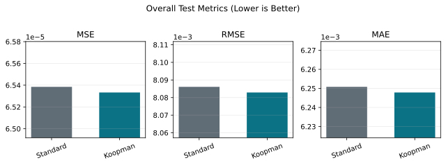

# Koopman-GAT-LSTM Frequency Forecasting

PyTorch implementation of a Koopman-enhanced GAT-LSTM model for multi-node power-grid frequency response forecasting.

The repository provides:

- a standard GAT-LSTM baseline
- a Koopman-GAT-LSTM variant that injects node-level Koopman energy into graph-attention logits
- workbook readers and dataset artifact helpers
- training, evaluation, and formal comparison CLIs
- attention-entropy utilities
- key-node Excel/plot export utilities
- synthetic tests for the public code path

## Privacy and Data Availability

This public repository intentionally does **not** include private project data, customer workbooks, trained checkpoints, prediction files, logs, or experiment outputs.

Excluded artifact classes include:

- raw Excel workbooks
- generated `dataset.npz` files
- model checkpoints such as `best.pt`
- prediction arrays
- formal experiment outputs
- customer documents

To reproduce with your own data, prepare compatible workbooks under `data/raw/` or provide a generated dataset artifact via `--dataset-artifact`.

## Dataset Summary

The private experiment data used during development is not released. The following summary is provided only to describe the task scale and tensor contract:

| Item | Value |
| --- | ---: |
| System size | 39 nodes |
| Sampling rate | 100 Hz |
| Input window | `[5.00, 5.40)` |
| Input steps | 40 |
| Forecast window | `[5.40, 8.00)` |
| Forecast steps | 260 |
| Samples used in the private experiment | 382 operating cases |
| Train / validation / test split | 267 / 38 / 77 |
| Frequency tensor shape | `[samples, 40, 39]` |
| Target tensor shape | `[samples, 260, 39]` |
| Koopman tensor shape | `[samples, 39]` |

The released code can be used with user-provided workbooks or a compatible prebuilt dataset artifact. Case names, raw curves, operating-condition labels, and original workbooks are not included.

## Method Summary

The task is graph spatiotemporal forecasting over an IEEE-style multi-node power-grid system.

For each sample:

- input frequency window: `[5.00, 5.40)`, 40 time steps at 100 Hz
- forecast window: `[5.40, 8.00)`, 260 future time steps
- node count: 39
- graph input: fixed adjacency matrix
- Koopman input: one node-level Koopman energy vector per operating case

The Koopman-GAT-LSTM model uses:

```text
input -> GAT layer 1 -> GAT layer 2 -> LSTM -> fully connected output
```

Koopman energy is injected into each GAT layer before softmax:

```text
e'_ij = e_ij + softplus(beta) * K_tilde_j
```

where `K_tilde_j` is the normalized Koopman energy of neighbor node `j`.

## Private Experiment Metrics

The table below reports aggregate test metrics from one private experiment run. It is included to document the observed behavior of the implementation, not to release the underlying data.

| Model | MSE | RMSE | MAE |
| --- | ---: | ---: | ---: |
| Standard GAT-LSTM | 6.538496e-05 | 0.008086 | 0.006251 |
| Koopman-GAT-LSTM | 6.533291e-05 | 0.008083 | 0.006248 |

Lower is better. In this run, Koopman-GAT-LSTM is slightly better than the standard baseline, but the margin is small.



Prediction curves and raw case-level plots are intentionally not included because they are derived from private operating-case data.

## Installation

Create an environment and install dependencies:

```bash
python -m venv .venv
source .venv/bin/activate
python -m pip install --upgrade pip
python -m pip install -r requirements.txt
python -m pip install -e .
```

For CUDA-enabled training, install the PyTorch build that matches your CUDA version before or instead of the generic `torch` package in `requirements.txt`.

## Quick Test

```bash
PYTHONPATH=src python -m pytest tests -q
```

The test suite uses synthetic data and does not require private Excel files.

## Expected Data Layout

The default configuration uses placeholder paths:

```yaml
paths:
  frequency_workbook: data/raw/frequency_workbook.xlsx
  koopman_workbook: data/raw/koopman_energy.xlsx
  adjacency_workbook: data/raw/adjacency_matrix.xlsx
```

Private data is ignored by git. Put your own files under `data/raw/` if you want to use the workbook ingestion path.

The expected logical inputs are:

- frequency workbook: one sheet per operating case
- Koopman workbook: one row per operating case and one column per node
- adjacency workbook: fixed node-by-node graph structure
- canonical node order: `BUS1` through `BUS39`

## Smoke CLI

Minimal smoke commands:

```bash
PYTHONPATH=src python -m koopman_gat_lstm.cli.train --config configs/default.yaml --smoke
PYTHONPATH=src python -m koopman_gat_lstm.cli.eval --config configs/default.yaml --smoke
```

Full training requires a dataset artifact:

```bash
PYTHONPATH=src python -m koopman_gat_lstm.cli.train \
  --config configs/default.yaml \
  --model-type koopman \
  --dataset-artifact outputs/dataset/dataset.npz \
  --run-dir outputs/koopman_run
```

Standard baseline:

```bash
PYTHONPATH=src python -m koopman_gat_lstm.cli.train \
  --config configs/default.yaml \
  --model-type standard \
  --dataset-artifact outputs/dataset/dataset.npz \
  --run-dir outputs/standard_run
```

## Repository Scope

This repository is a code release for the method implementation. It is not a public release of the private training dataset or project-specific formal experiment results.

## License

MIT License. See [LICENSE](LICENSE).
